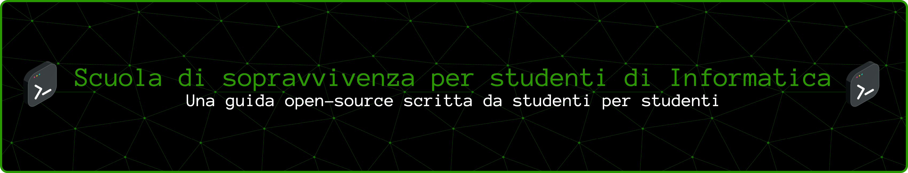

# Cosa troverai


Consigli pratici, errori da evitare, strategie testate sul campo e molto altro per sopravvivere al corso di Informatica dell'Università di Udine.    
**Leggi i volumi della guida da PC** per una migliore esperienza di navigazione.  
**Ti consiglio di scaricarli** per poter cliccare sui link nei PDF.

|Volume|Contenuto|Stato|
|---|---|---|
|**Volume 1**|Consigli generali|<div align="center">[](https://github.com/Verryx-02/Scuola-di-sopravvivenza-per-studenti-di-Informatica/raw/main/Volume1.pdf)</div>|
|**Volume 2**|Consigli specifici per ogni esame|<div align="center">[](https://github.com/Verryx-02/Scuola-di-sopravvivenza-per-studenti-di-Informatica/raw/main/Volume2.pdf)</div>|
|**Volume 3**|Consigli per studenti fuori-sede|<div align="center">[](https://github.com/Verryx-02/Scuola-di-sopravvivenza-per-studenti-di-Informatica/raw/main/Volume3.pdf)</div>|


# Come scaricare i PDF

## Opzione 1: Download-Diretto

Scarica i singoli volumi che ti interessano cliccando i badge verdi qui sopra. (Puoi scaricare solo quelli marcati come disponibili) 

---

## Opzione 2: Download da terminale

#### Volume 1

```bash
curl -L -o Volume1.pdf "https://github.com/Verryx-02/Scuola-di-sopravvivenza-per-studenti-di-Informatica/raw/main/Volume1.pdf"
```

---

## Opzione 3: Clona tutto il progetto

Se vuoi anche i file sorgente LaTeX:

```bash
git clone https://github.com/Verryx-02/Scuola-di-sopravvivenza-per-studenti-di-Informatica.git
```

---

# Domande frequenti
- Se ho già letto il pdf mesi fa e ora è stato aggiornato, devo rileggerlo tutto per capire cosa è stato modificato?
No, ti basta guardare i commit [qui](https://github.com/Verryx-02/Scuola-di-sopravvivenza-per-studenti-di-Informatica/commits/main/)
Cliccando su ogni commit puoi vedere le singole modifiche ai file.  
Ti basta ricordarti a grandi linee quando hai scaricato la guida l'ultima volta (puoi guardare i metadati del tuo file), poi leggere tutti i commit da quel momento in poi.   
Le righe in rosso sono quelle eliminate, quelle in verde sono quelle aggiunte. 


# Contribuisci!

Sentiti libero di contribuire! Prima di iniziare, leggi le [linee guida per contribuire](https://github.com/Verryx-02/Scuola-di-sopravvivenza-per-studenti-di-Informatica/blob/main/CONTRIBUTING.md)